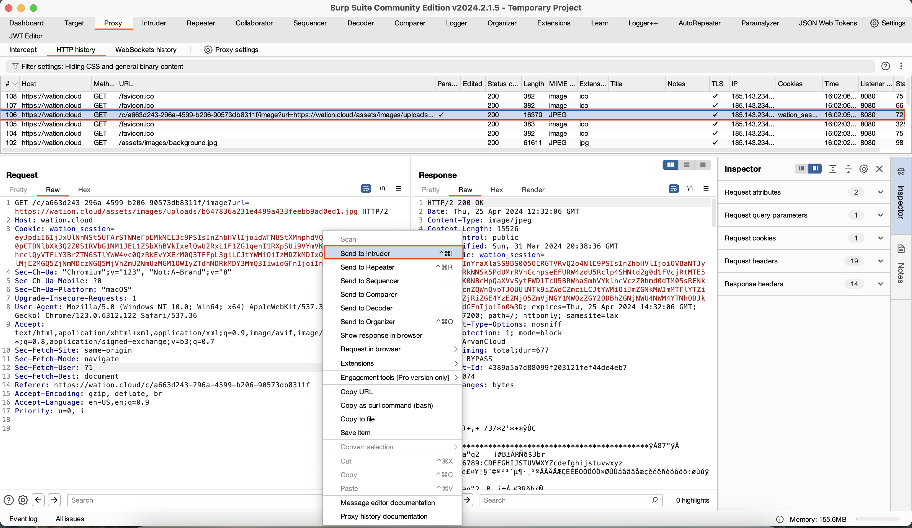
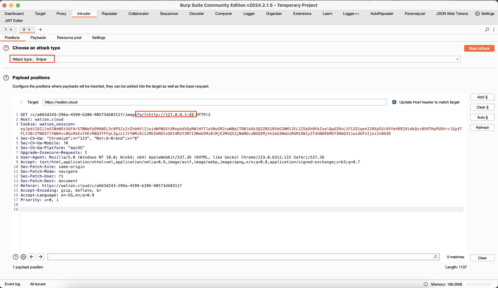
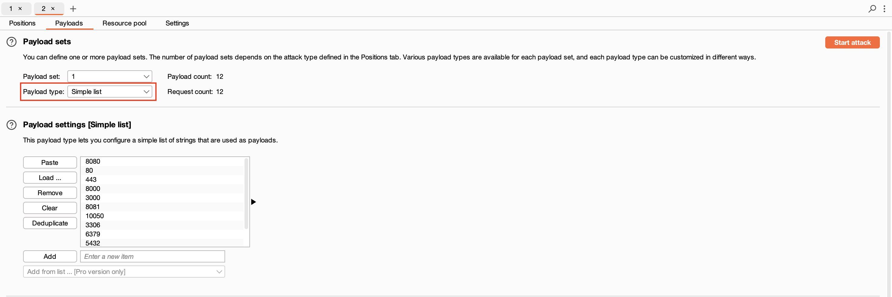
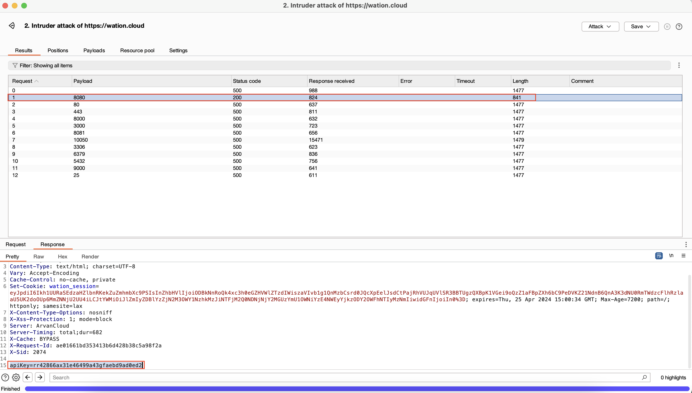
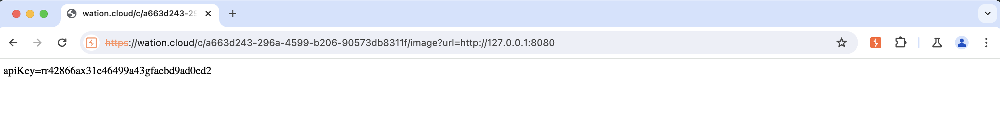

# SSEF#1

سلام [محمد حسین نوری](https://www.linkedin.com/in/itismhn/)
 هستم و در این رایتاپ چالش SSRF#1 رو حل می‌کنیم.

برای حل کردن این چالش،‌ ابتدا باید آسیب پذیری SSRF رو خوب بشناسیم و با روش های Exploit آشنا باشیم.

## درباره SSRF
به زبان ساده  ‍‍‍‍‍‍Server Side Request Forgery (SSRF) به نفوذگر این امکان رو میده که سرور وب اپلیکیشن رو مجبور به ارسال درخواست به آدرس دلخواه خودش کنه.

زمانی که این آسیب پذیری بوجود بیاد،‌ نفوذگر می‌تونه یک سری فعالیت بر علیه سرور انجام بده برای مثال می‌تونه آی‌پی های داخلی رو اسکن کنه و یا اطلاعات برروی Local Host  بخونه و ... 

  یکی از این موارد موضوع این چالش هست و در ادامه سناریوی این حمله توضیح داده شده.
### سناریو حمله علیه local server

یکی از سناریو های این حمله ارسال درخواست به آدرس داخلی سرور یعنی `localhost` هست. عموما توسعه دهندگان سایت روی پورت مشخصی از سرور اطلاعات حساس و یا صفحه مدیریت رو قرار می‌دهند و این محل رو محلی امن می‌دونن!
حالا نفوذگر می‌تونه توی این بخش FUZZ انجام بده تا به صفحه و اطلاعات دلخواهش برسه.

### پیلود های مورد نیاز
بسته به شرایط نوع پیلود های SSRF تغییر می‌کنه اما اینجا چند تا از رایج ترین پیلود های مورد استفاده قرار داده شده

```
http://localhost:80
http://127.0.0.1:80
http://0.0.0.0:80
http://[::]:80
http://127.127.127.127:80
http://127.0.1.3:80
http://127.0.0.0:80
```
شما می‌تونید به جای پورت `80` پورت های دیگه قرار بدید

### پورت های رایج

```
80 443 8000 8080 3000 8081 -> HTTP
10050 -> Zabbix
3306 -> Mysql
6379 -> Redis
5432 -> Postgresql
9000 -> FastCGI
25 -> SMTP
```
برای بررسی دقیق تر می‌تونید تمامی پورت های موجود(`1-65535`) رو اسکن کنید تا به نتیجه های بیشتر برسید.

## حل چالش
بعد از وارد شدن به بخش چالش با این صفحه رو به رو می‌شیم:


دکمه و ورودی های این صفحه غیرفعال هستند، بخش دیگه ای برای انجام حمله وجود نداره و باید یکم بیشتر بگردیم!


درخواست ما به این صفحه هم مقدار خاصی نداره و نکته چالش اینجا نیست!


با بررسی Response متوجه این بخش می‌شیم!

یک تگ html که مربوط به تصویر پروفایلی هست که در صفحه اول چالش وجود داره.

البته که توی Source سایت هم میشد این مورد رو دید.


در اینجا تگ ‌img وجود دارد که تصویر رو از یک آدرس اینترنتی می‌خونه و توی صفحه نمایش می‌ده.


آدرس عکس پروفایل
‍`https://wation.cloud/assets/images/uploads/b647836a231e4499a433feebb9ad0ed1.jpg`

در اصل این صفحه با ارسال درخواست به این آدرس اینترنتی عکس را بارگذاری می‌کند و در صفحه نمایش می‌کند.

بجای آدرس تصویر پیلود ها رو جایگذاری می‌کنیم


همانطور که گفته شد، سناریوی این چالش بدست آوردن اطلاعات حساسی است که  روی یک Port خاص از localhost وجود دارد 

به همین منظور می‌تونیم از ابزار Intruder در burp suite و یا FFUF استفاده کنیم.


### اسکن پورت با استفاده از Intruder
برای این کار: 
1. ارسال درخواست مورد نظر به `Intruder`
2. در بخش درخواست علامت های `$$` به جای پورت می‌گذاریم
`$$:url=http://127.0.0.1`
3. انتخاب Sniper‌ به عنوان Attack Type 
4. انتخاب نوع پیلود و ‌‌شروع حمله

---
درخواست رو انتخاب می‌کنیم و با کلیک راست کردن و انتخاب گزینه `send to intruder` درخواست رو به ابزار می‌فرستیم



در `Intruder` پیلود مورد نظر را طبق تصویر وارد می‌کنیم و `attack type` رو برابر `Sniper` قرار می‌دیم.



برای وارد کردن لیست پورت های رایج، `Payload type` رو برابر `simple List` قرار می‌دیم
سپس لیست پورت های رایج رو اضافه می‌کنیم.

برای اسکن تمامی پورت های موجود، `numbers` را از بیست `payload types` انتخاب کنید و بازه اعداد را بین `0` و `65535` قرار بدید




بعد از زدن دکمه `start attack` ابزار شروع به جایگزینی هر ‌payload و ارسال هرکدوم هست و نتیجه به شکل زیر است



همینطور که در تصویر مشخص هست، در اینجا شماره پورت `8080` با ‌status code 200 پاسخ داده شده و length این درخواست هم با بقیه متفاوت هست
و در بخش پاسخ این درخواست `ApiKey` افشا شده.


شماره پورت رو به url  و پیلود اضافه می‌کنیم و آدرس  نهایی برابر آدرس زیر می‌شه:

`https://wation.cloud/c/x/image?url=http://127.0.0.1:8080`

و با موفقیت تونستیم این چالش رو حل کنیم و امتیازش رو دریافت کنیم.